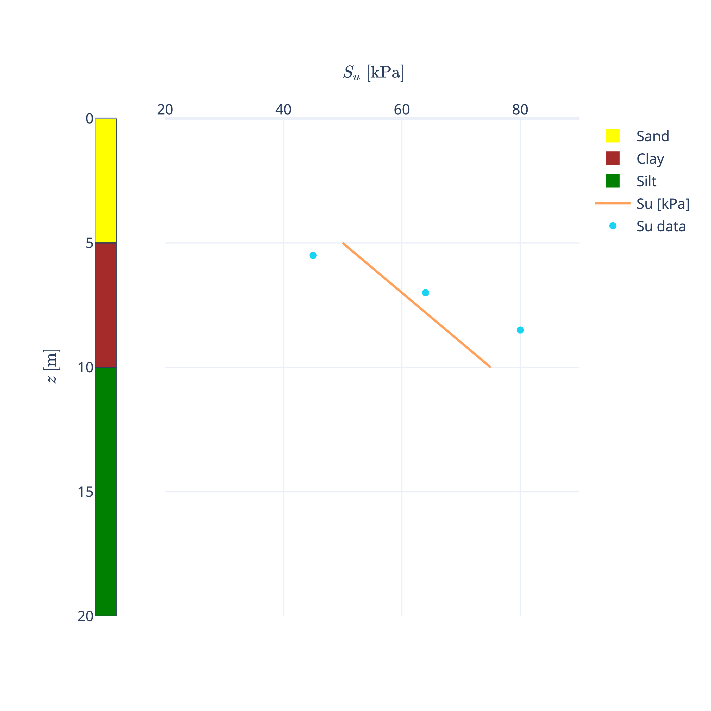

# Summary

Geotechnical engineering is an engineering discipline in which the mechanical behaviour of soil and its impact on the performance of foundations is studied. Because of the complex constitutive behaviour of soil and the large variation in mineralogy, geological origins, stress conditions and foundation types, there is no generally applicable theory for soil behaviour and foundation design. Instead, myriad semi-empirical models and parameter correlations have been developed to describe the mechanical behaviour of soils and foundations [@Budhu:2010]. The Python package `Groundhog` was developed to allow the efficient use of these formulae in geotechnical engineering education, research and practice. 

# Statement of need

`Groundhog` is a Python package for geotechnical engineering calculations. The soil parameter correlations and foundation design models which are used in this discipline are scattered across various resources (textbooks, journal articles, recommended practices) and engineers spend a significant amount of time implementing them in calculation tools (typically Microsoft Excel). This is not an ideal situation, with a lot of repeated work and implementation mistakes often going undetected. Moreover, certain geotechnical calculations are calibrated for specific ranges of the input parameters. Checking that the inputs are within these ranges is often omitted in an Excel implementation.

To overcome these shortcomings, `Groundhog` provides a robust implementation of geotechnical functions with in-built parameter validation and [extensive documentation](https://groundhog.readthedocs.io/). Each input parameter is described, providing the expected units and the default validation range. The validation ranges can be overriden by the user with specific keyword arguments, making adjustments to the validation ranges explicitly visible.

Because geotechnical functions can return multiple outputs (e.g. intermediate calculation results), the output of `Groundhog` functions are Python dictionaries. The users can select the relevant outputs for their calculations by addressing the appropriate dictionary key. `Groundhog` functions are also unit-tested to ensure they return the expected results.

In addition to geotechnical functions, selected geotechnical workflows are encoded in an object-oriented manner. Processing of data from the cone penetration test (CPT) and the standard penetration tests (SPT) is a recurring task and the steps in the processing workflow are implemented in the `PCPTProcessing` and `SPTProcessing` classes respectively. The manipulation of stratigraphic profiles describing the various layers in the subsoil, is made possible with the `SoilProfile` class. Soil parameter visualisation and interactive parameter selection is made possible in the `LogPlot` class (using the `Plotly` [@plotly] plotting backend) and the `LogPlotMatplotlib` class (using `Matplotlib` [@Hunter:2007] as plotting backend).

The package implements various methods for basic foundation design taught in undergraduate and graduate course (e.g. shallow foundation capacity on sand and clay, axial pile resistance in sand clay, one-dimensional consolidation).

`Groundhog` is under continuous development and allows the geotechnical community to focus on a single robust and well-documented set of calculation tools.

# Applications in research

The geotechnical parameter correlations and geotechnical workflow automation tools have enabled research in offshore wind geotechnical engineering on the following topics:

- Natural frequency analysis of offshore wind turbine structures across an entire offshore wind farm [@fallais:2022]. `Groundhog` was used to define the stratigraphic profiles and perform the geotechnical parameter selection. The automation offered by `Groundhog` allowed all data to be processed in a reasonable time and with a focus on quality.
- Back-analysis of bending moment measurements on offshore wind turbine monopiles [@stuyts:2024]. `Groundhog` was used to define the stratigraphic profiles and perform the geotechnical parameter selection.
- Evaluation of CPT-based correlations for shear wave velocity estimation for North Sea soils [@stuytsshear:2024]. All correlations evaluated in the study were implemented in `Groundhog` and a newly developed correlation was shared with the community through implementation in the package.
- `Groundhog` is also being used in research on seismic inversion. Amplitude vs Offset (AVO) inversion allows inversion for bulk modulus, shear modulus and density. Groundtruth geotechnical data is processed with `Groundhog` and where direct measurements of the parameters are not available, the package is used to estimate them from other data sources.

# Applications in geotechnical engineering education

`Groundhog` is being used in undergraduate and graduate courses at Ghent University. The package allows students to spend more time on the parameter selection process and get more insight into the underlying data for the semi-empirical correlations. The effect of parameter variations can also easily be studied while reducing the time spent on implementing equations.

A dedicated two-day training course has also been set up to teach Python and `Groundhog` to geotechnical engineers seeking to get started with scripting. This course has been delivered to Systra in Dubai (April 2024) and RINA in Milan (October 2024).

# Selected examples

## Parameter validation

The parameter validation functionality can be demonstrated using the function `relativedensity_sand_jamiolkowski` which is used to estimate the relative density of sand from CPT data. The function takes cone tip resistance (`qc`), vertical effective stress (`sigma_vo_eff`) and the coefficient of lateral earth pressure (`k0`) as inputs. The function returns two unitless outputs as a Python dictionary; the relative density for dry sand (`Dr dry [-]`) and the relative density for saturated conditions (`Dr sat [-]`).

The function was developed based on calibration chamber tests with vertical effective stresses for these tests varying between 50kPa and 400kPa. Hence, only vertical effective stresses in that range are allowed. When a user attempts to execute the function for a vertical effective stress of 10kPa, the function will return `nan` for both outputs.

However, the user can override the validation range. By appending `__min` or `__max` to the argument for which the validation range needs overriding, the default validation range is adjusted. By providing `sigma_vo_eff__min=10` as an additional argument, the function will return numerical values for the relative density even though the selected value of vertical effective stress is lower than 50kPa. The overriding of the validation range is explicitly visible in the function call, a minimum vertical effective stress of 10kPa is allowed. The outputs are not realistic (relative density cannot be greater than 1), but the reader of the code can directly connect this to the vertical effective stress which is outside the default validation range.

```python
>>> from groundhog.siteinvestigation.insitutests.pcpt_correlations import \
    relativedensity_sand_jamiolkowski
>>> relativedensity_sand_jamiolkowski(
    qc=20, sigma_vo_eff=10, k0=0.8)
{'Dr dry [-]': nan, 'Dr sat [-]': nan}
>>> relativedensity_sand_jamiolkowski(
    qc=20, sigma_vo_eff=10, k0=0.8, sigma_vo_eff__min=10)
{'Dr dry [-]': 1.083398634171661, 'Dr sat [-]': 1.252988806617474}
```

## Plotting of geotechnical data and stratigraphy

Plotting geotechnical parameter against depth and inspecting parameter values in relation to the soil layering is a central task in geotechnical engineering. Excel-based tools do not offer functionality to easily combine the visualisation of stratigraphy and parameter values. The `SoilProfile` class in `Groundhog` allows easy encoding and manipulation of stratigraphic profiles. The example below generates a stratigraphic profile with three layers. A top layer of sand with a thickness of 5m is underlain by a clay layer of 5m thickness. Below, a silt layer of 10m thickness is found. A constant value of total unit weight of the soil in each layer is specified and the undrained shear strength ($S_u$) trend is defined in the clay layer as a linear variation.

```python
from groundhog.general.soilprofile import SoilProfile
sp = SoilProfile({
    'Depth from [m]': [0, 5, 10],
    'Depth to [m]': [5, 10, 20],
    'Soil type': ['Sand', 'Clay', 'Silt'],
    'Total unit weight [kN/m3]': [19, 17, 18],
    'Su from [kPa]': [np.nan, 50, np.nan],
    'Su to [kPa]': [np.nan, 75, np.nan]})
```

The `SoilProfile` object can be visualised using the `LogPlot` class as shown in the example below. A stratigraphic log is plotted on the left and the three soil types are assigned different colors (yellow for sand, brown for clay and green for silt). Three direct measurements of undrained shear strength are plotted in the first (and only) plotting panel, to check the validity of the $S_u$ relation proposed in the `SoilProfile` object.

```python
from groundhog.general.plotting import LogPlot
# Create the LogPlot object based on the SoilProfile object
log_plot = LogPlot(sp, no_panels=1,   
    fillcolordict={'Sand': 'yellow', 'Clay': 'brown', 'Silt': 'green'})
# Plot the undrained shear strength trend defined in the SoilProfile
log_plot.add_soilparameter_trace('Su [kPa]', panel_no=1)
# Plot undrained shear strength data (3 measurements) in the first panel
log_plot.add_trace(
    x=[45, 64, 80], z=[5.5, 7, 8.5],
    panel_no=1, mode='markers',
    name='Su data')
# Set the axis titles (With LaTeX) and ranges
log_plot.set_xaxis(
    title=r'$ S_u \ \text{[kPa]} $', 
    panel_no=1, range=(20, 90))
log_plot.set_zaxis(
    title=r'$ z \ \text{[m]} $', 
    range=(20, 0))
# Show the plot
log_plot.show()
```



The result is shown in \autoref{fig:stratigraphy}. It shows that the selected $S_u$ trend is not unreasonable, but a steeper trend might be justified. A geotechnical engineer with knowledge on the site geology can then choose to adjust this trend based on the given data.

# Acknowledgements

We acknowledge contributions from Berk Demir for providing the first examples of Streamlit applications with `Groundhog`.

# References

