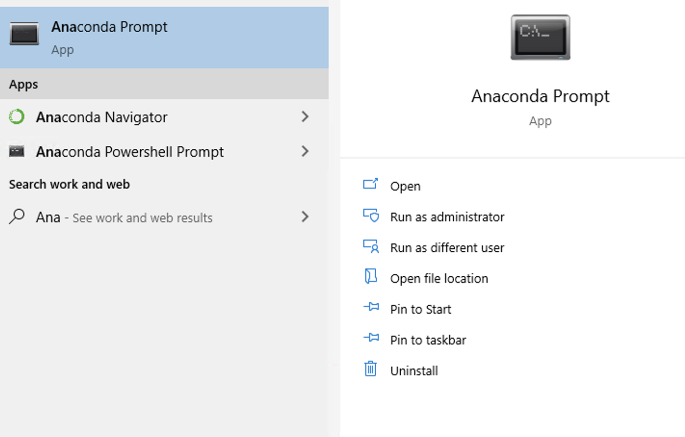
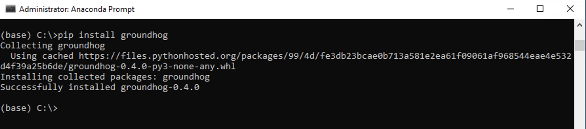
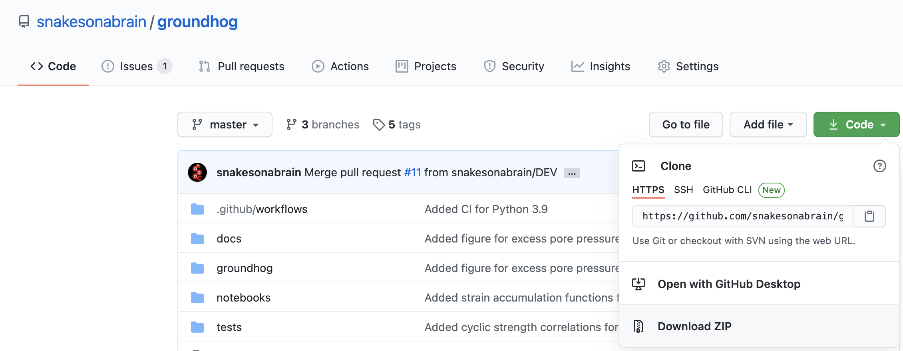
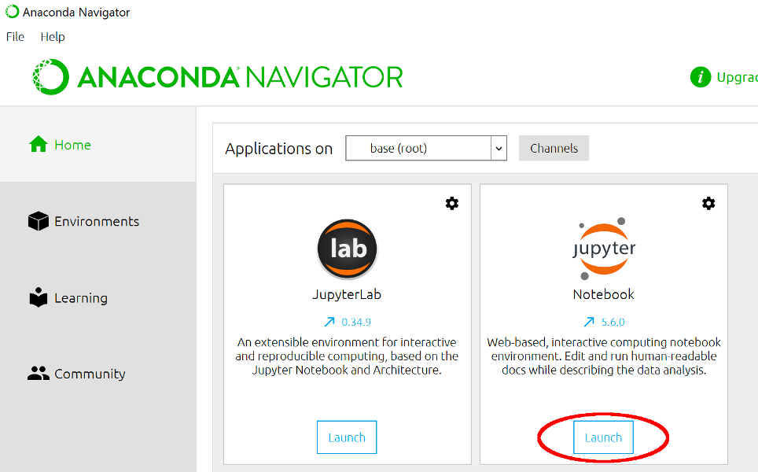

Getting started with groundhog
===============================================

1. Installation
----------------------

1.1. Installing Python
^^^^^^^^^^^^^^^^^^^^^^^^^^^^^

`Anaconda <http://www.anaconda.com/>`_ installs a Python environment and 100+ frequently used packages on your computer.
Installing Anaconda is recommended if you don’t have Python on your system yet.

If you have an existing Python environment on your system, you need to ensure that the package dependencies are installed.

1.2. Installing groundhog
^^^^^^^^^^^^^^^^^^^^^^^^^^^^^

On Windows machines, you need to open an Anaconda command prompt. Depending on your system settings,
you may need to run as Administrator.

On Mac and Linux, you can type open a terminal window.

groundhog can then be installed in your Python environment using pip:

.. code-block:: bash

    pip install groundhog

1.3. Installing dependencies
^^^^^^^^^^^^^^^^^^^^^^^^^^^^^^^^^

groundhog has a number of package dependencies, most of which come installed with Anaconda.

However, the following packages need to be added manually:

- Plotly is a package used for plotting, it can be installed with conda by typing the following command in an Anaconda Command Prompt or a terminal window:

.. code-block:: bash
    :linenos:

    conda install plotly

- xlrd and openpyxl are packages for reading and writing data to and from Excel. These packages can also be installed using conda:

.. code-block:: bash

    conda install xlrd

.. code-block:: bash

    conda install openpyxl

- Since groundhog 0.7.0, pyproj is required to handle coordinate transformations. This package can also be installed using conda:

.. code-block:: bash

    conda install pyproj

- For users of the Flemish geotechnical database pydov, a Python module for interaction with this database can be installed. This package is an optional dependency and can be installed using pip:

.. code-block:: bash

    pip install pydov

1.4. Installing from source (advanced)
^^^^^^^^^^^^^^^^^^^^^^^^^^^^^^^^^^^^^^^^

The source code of groundhog can be downloaded as a .zip file from `GitHub <https://github.com/snakesonabrain/groundhog/>`_ or cloned with git.

Once the source code is on your system, you can install it in your Python environment
by navigating to the folder containing the source code (folder with the file ``setup.py``)
and executing the following command in an Anaconda Command Prompt or terminal window:

.. code-block:: bash

    python setup.py install

2. Learning Python
----------------------

2.1. Jupyter notebooks
^^^^^^^^^^^^^^^^^^^^^^^^^^^

`Jupyter notebooks <https://www.jupyter.org/>`_ are interactive calculation documents with a mix of text, figures and code.
They provide full transparency on a calculation workflow and are thus used to demonstrate groundhog functionality in the tutorial notebooks.
Jupyter notebooks are created and edited in the browser and a local development server needs to be started.
You can do this in one step with the Anaconda Navigator (installed with Anaconda).
Open the Anaconda Navigator and click the “Launch” button in the Jupyter notebook widget.
This will start the local development server and open a file explorer in your browser.

2.2. Online resources
^^^^^^^^^^^^^^^^^^^^^^^^^^^

Many geotechnical engineers ask me what the best way of learning Python is.
There are several learning resources available online. I can recommend the following ones:

- `RealPython <https://realpython.com/>`_ : A website packed with Python resources, from basic to advanced topics. Many articles are available free of charge but courses need to be purchased.

- `Practical Business Python <https://pbpython.com/excel-pandas-comp.html>`_ : This is an excellent website, especially for engineers with an Excel background, as it shows how many common Excel tasks can be performed with Python (and the Pandas library). Learning how to work with Pandas is highly recommended.

- `Plotly package documentation <https://plotly.com/python/basic-charts/>`_ : Plotly is an excellent package for creating interactive plots. Any Python user will need to spend time reading documentation and the explanations on charting with Plotly are an excellent way to learn by example.

- `DataCamp <https://www.datacamp.com/>`_ : Online learning platform for learning Python and data science. Subscriptions are not the cheapest but rapid progress can be made using the interactive learning modulus.

3. First steps with groundhog
-------------------------------------

The first steps with groundhog are best taken by following the interactive tutorials on `Binder <https://mybinder.org/v2/gh/snakesonabrain/groundhog/main>`_ .
You don't need to install any software on your system, everything runs in the browser.

.. image:: https://mybinder.org/badge_logo.svg
 :target: https://mybinder.org/v2/gh/snakesonabrain/groundhog/main

The amount of changes you can make to the tutorials through Binder is limited and
when you start building your own workflows, installing Python (see Section 1) is required.

The tutorial notebooks can also be downloaded together with the source code.

Calling groundhog functions is a matter of importing them and the filling in the arguments with correct units.
Guidance on units and allowed parameter ranges is included in the package documentation.
The example below calculates relative density from cone tip resistance (in MPa), vertical effective stress (in kPa) and coefficient of lateral earth pressure (unitless).

.. code-block:: python

    from groundhog.siteinvestigation.insitutests.pcpt_correlations import relativedensity_sand_jamiolkowski
    relativedensity_sand_jamiolkowski(qc=20, sigma_vo_eff=100, k0=0.8)

The function calculates the relative density, based on calibration chamber tests, for dry and saturated conditions.

.. code-block:: python

    {'Dr dry [-]': 0.7255644643144783, 'Dr sat [-]': 0.8341092199995009}