Tutorial: PCPT processing
============================

A PCPT processing tool has been created for use by the students of the
geotechnics and offshore foundations courses. This tool is made
available to allow rapid checking of the sensitivity to processing
parameters.

.. code:: ipython3

    import numpy as np
    import os
    from IPython.display import HTML
    import pandas as pd

.. code:: ipython3

    from plotly.offline import init_notebook_mode, iplot
    init_notebook_mode()

.. code:: ipython3

    from groundhog.site_investigation.pcpt_processing import PCPTProcessing

1. Loading data
---------------

1.1. Excel import
~~~~~~~~~~~~~~~~~

The first way to load data is from a Pandas dataframe using the
``load_excel`` method. A dataframe is be created from Excel data and
added as the ``.data`` attribute of the PCPTProcessing object. Note that
:math:`q_c`, :math:`f_s` and :math:`u_2` need to have the dimension MPa. If they
don’t multipliers can be specified to convert them to these dimensions.

.. code:: ipython3

    pcpt = PCPTProcessing(title="Example PCPT")

.. code:: ipython3

    pcpt.load_excel(path="Data/debeer_example.xlsx",
                           u2_key="u [kPa]", u2_multiplier=0.001)
    pcpt.data.head()

.. raw:: html

    

    
    <table border="1" class="dataframe">
      <thead>
        <tr style="text-align: right;">
          <th></th>
          <th>z [m]</th>
          <th>qc [MPa]</th>
          <th>fs [MPa]</th>
          <th>Rf [%]</th>
          <th>u2 [MPa]</th>
          <th>Push</th>
        </tr>
      </thead>
      <tbody>
        <tr>
          <th>0</th>
          <td>0.00</td>
          <td>0.00</td>
          <td>0.000</td>
          <td>NaN</td>
          <td>0.000</td>
          <td>NaN</td>
        </tr>
        <tr>
          <th>1</th>
          <td>0.02</td>
          <td>0.00</td>
          <td>0.003</td>
          <td>0.0</td>
          <td>0.004</td>
          <td>1.0</td>
        </tr>
        <tr>
          <th>2</th>
          <td>0.04</td>
          <td>0.00</td>
          <td>0.003</td>
          <td>0.0</td>
          <td>0.004</td>
          <td>1.0</td>
        </tr>
        <tr>
          <th>3</th>
          <td>0.06</td>
          <td>0.35</td>
          <td>0.003</td>
          <td>0.9</td>
          <td>0.002</td>
          <td>1.0</td>
        </tr>
        <tr>
          <th>4</th>
          <td>0.08</td>
          <td>0.44</td>
          <td>0.003</td>
          <td>0.7</td>
          <td>0.000</td>
          <td>1.0</td>
        </tr>
      </tbody>
    </table>
    

The raw PCPT data can be visualized with the ``plot_raw_pcpt`` method.

.. code:: ipython3

    pcpt.plot_raw_pcpt()

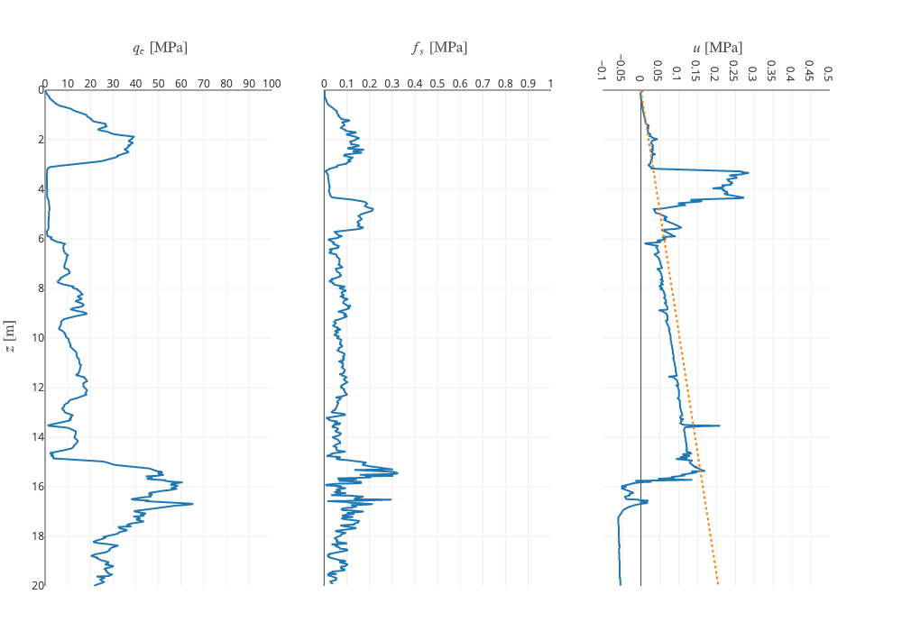

        Figure 1:  Raw PCPT data imported from Excel

1.2. Reading .asc data
~~~~~~~~~~~~~~~~~~~~~~

The class also has the function ``load_asc`` for loading .asc data.

.. code:: ipython3

    pcpt_asc = PCPTProcessing(title="ASC PCPT")
    pcpt_asc.load_asc(path="Data/acs_example.asc",
                      column_widths=[5, 9, 10, 11, 11, 11, 11],
                      z_key="Depth [m]", qc_key="Cone [MPa]", fs_key="Friction [MPa]", u2_key="Pore 2 [MPa]")
    pcpt_asc.data.head()

.. raw:: html

    

    
    <table border="1" class="dataframe">
      <thead>
        <tr style="text-align: right;">
          <th></th>
          <th>Rec [No]</th>
          <th>z [m]</th>
          <th>Time [s]</th>
          <th>qc [MPa]</th>
          <th>fs [MPa]</th>
          <th>u2 [MPa]</th>
          <th>SlopeOmni [Deg]</th>
          <th>Push</th>
        </tr>
      </thead>
      <tbody>
        <tr>
          <th>0</th>
          <td>1.0</td>
          <td>0.00</td>
          <td>2543.63</td>
          <td>0.0737</td>
          <td>NaN</td>
          <td>NaN</td>
          <td>4.7199</td>
          <td>1</td>
        </tr>
        <tr>
          <th>1</th>
          <td>2.0</td>
          <td>0.02</td>
          <td>2545.06</td>
          <td>0.1025</td>
          <td>NaN</td>
          <td>0.0007</td>
          <td>4.7120</td>
          <td>1</td>
        </tr>
        <tr>
          <th>2</th>
          <td>3.0</td>
          <td>0.04</td>
          <td>2546.09</td>
          <td>0.1609</td>
          <td>NaN</td>
          <td>0.0008</td>
          <td>4.6951</td>
          <td>1</td>
        </tr>
        <tr>
          <th>3</th>
          <td>4.0</td>
          <td>0.06</td>
          <td>2547.25</td>
          <td>0.2401</td>
          <td>0.0020</td>
          <td>0.0008</td>
          <td>4.6921</td>
          <td>1</td>
        </tr>
        <tr>
          <th>4</th>
          <td>5.0</td>
          <td>0.08</td>
          <td>2548.13</td>
          <td>0.2970</td>
          <td>0.0022</td>
          <td>0.0012</td>
          <td>4.6937</td>
          <td>1</td>
        </tr>
      </tbody>
    </table>
    

.. code:: ipython3

    pcpt_asc.plot_raw_pcpt(u2_range=(-0.2, 2), u2_tick=0.2)

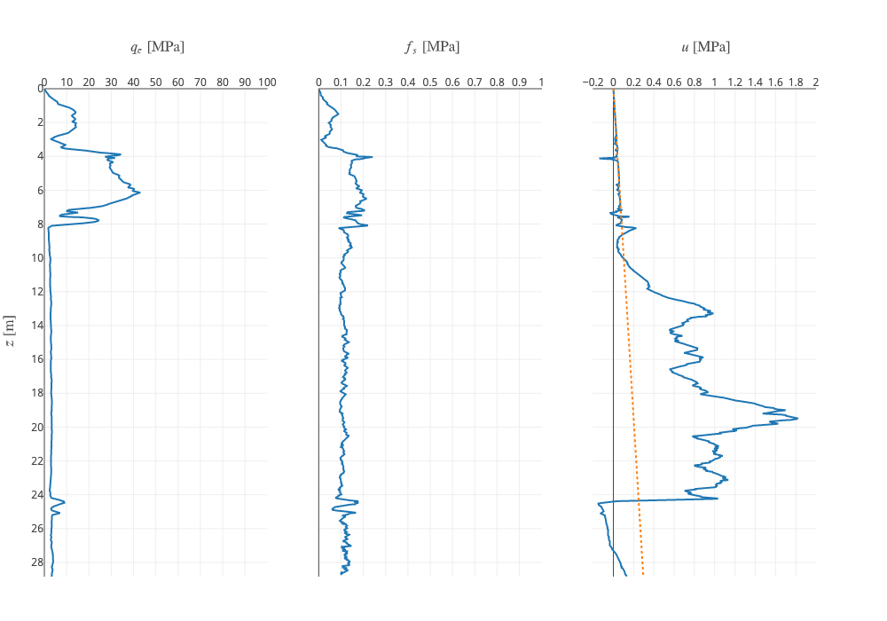

        Figure 2: Visualisation of data imported from .asc file

1.3. Reading AGS data
~~~~~~~~~~~~~~~~~~~~~

AGS is a common data transfer for geotechnical data. Rapidly importing
PCPT data from this format is useful to allow further processing.

We can first read an ags file with the function ``read_ags``.

.. code:: ipython3

    from groundhog.site_investigation.read_site_data import read_ags

.. code:: ipython3

    ags_pcpt_data = read_ags(file_path="Data/N6016_BH_WFS1-2A_AGS4_150909.ags", groupname="SCPT")
    ags_pcpt_data.head()

.. parsed-literal::

    /anaconda3/envs/geotech37/lib/python3.6/site-packages/ugentgeotechnics-0.1.0-py3.6.egg/geotechnics/site_investigation/read_site_data.py:57: UserWarning:

    No empty row detected below group, reading to the end of the file

.. raw:: html

    

    
    <table border="1" class="dataframe">
      <thead>
        <tr style="text-align: right;">
          <th></th>
          <th>HEADING [UNIT]</th>
          <th>LOCA_ID [nan]</th>
          <th>SCPG_TESN [nan]</th>
          <th>SCPT_DPTH [m]</th>
          <th>SCPT_RES [MN/m2]</th>
          <th>SCPT_FRES [kN/m2]</th>
          <th>SCPT_PWP2 [kN/m2]</th>
          <th>SCPT_FRR [%]</th>
          <th>SCPT_QT [MN/m2]</th>
          <th>SCPT_QNET [MN/m2]</th>
          <th>SCPT_BQ [nan]</th>
          <th>FILE_FSET [nan]</th>
        </tr>
      </thead>
      <tbody>
        <tr>
          <th>0</th>
          <td>DATA</td>
          <td>BH-WFS1-2A</td>
          <td>CPT01</td>
          <td>10.00</td>
          <td>2.955</td>
          <td>NaN</td>
          <td>NaN</td>
          <td>NaN</td>
          <td>2.980</td>
          <td>2.778</td>
          <td>0.0000</td>
          <td>NaN</td>
        </tr>
        <tr>
          <th>1</th>
          <td>DATA</td>
          <td>BH-WFS1-2A</td>
          <td>CPT01</td>
          <td>10.02</td>
          <td>5.167</td>
          <td>NaN</td>
          <td>100.9</td>
          <td>NaN</td>
          <td>5.192</td>
          <td>4.990</td>
          <td>0.0000</td>
          <td>NaN</td>
        </tr>
        <tr>
          <th>2</th>
          <td>DATA</td>
          <td>BH-WFS1-2A</td>
          <td>CPT01</td>
          <td>10.04</td>
          <td>7.808</td>
          <td>NaN</td>
          <td>102.7</td>
          <td>NaN</td>
          <td>7.834</td>
          <td>7.631</td>
          <td>0.0003</td>
          <td>NaN</td>
        </tr>
        <tr>
          <th>3</th>
          <td>DATA</td>
          <td>BH-WFS1-2A</td>
          <td>CPT01</td>
          <td>10.06</td>
          <td>10.612</td>
          <td>60.529</td>
          <td>102.2</td>
          <td>0.640</td>
          <td>10.638</td>
          <td>10.435</td>
          <td>0.0002</td>
          <td>NaN</td>
        </tr>
        <tr>
          <th>4</th>
          <td>DATA</td>
          <td>BH-WFS1-2A</td>
          <td>CPT01</td>
          <td>10.08</td>
          <td>13.479</td>
          <td>71.602</td>
          <td>101.8</td>
          <td>0.541</td>
          <td>13.504</td>
          <td>13.301</td>
          <td>0.0001</td>
          <td>NaN</td>
        </tr>
      </tbody>
    </table>
    

We can check which locations are present in the PCPT data. In this case,
there is only one location so we can use the entire dataframe.

.. code:: ipython3

    ags_pcpt_data["LOCA_ID [nan]"].unique()

.. parsed-literal::

    array(['BH-WFS1-2A'], dtype=object)

ags data also contains info on the location of the test. This can also
be retrieved with the following code:

.. code:: ipython3

    ags_location= read_ags("Data/N6016_BH_WFS1-2A_AGS4_150909.ags", groupname="LOCA")
    ags_location

.. raw:: html

    

    
    <table border="1" class="dataframe">
      <thead>
        <tr style="text-align: right;">
          <th></th>
          <th>HEADING [UNIT]</th>
          <th>LOCA_ID [nan]</th>
          <th>LOCA_TYPE [nan]</th>
          <th>LOCA_STAT [nan]</th>
          <th>LOCA_NATE [m]</th>
          <th>LOCA_NATN [m]</th>
          <th>LOCA_GL [m]</th>
          <th>LOCA_REM [nan]</th>
          <th>LOCA_FDEP [m]</th>
          <th>LOCA_STAR [yyyy-mm-dd]</th>
          <th>LOCA_PURP [nan]</th>
          <th>LOCA_TERM [nan]</th>
          <th>LOCA_ENDD [yyyy-mm-dd]</th>
          <th>LOCA_DATM [nan]</th>
          <th>LOCA_LAT [nan]</th>
          <th>LOCA_LON [nan]</th>
          <th>LOCA_LLZ [nan]</th>
        </tr>
      </thead>
      <tbody>
        <tr>
          <th>0</th>
          <td>DATA</td>
          <td>BH-WFS1-2A</td>
          <td>SCP</td>
          <td>NaN</td>
          <td>502763.64</td>
          <td>5732537.58</td>
          <td>NaN</td>
          <td>NaN</td>
          <td>64.39</td>
          <td>2015-04-10</td>
          <td>NaN</td>
          <td>NaN</td>
          <td>NaN</td>
          <td>NaN</td>
          <td>NaN</td>
          <td>NaN</td>
          <td>NaN</td>
        </tr>
      </tbody>
    </table>
    

Conversion to lat/lon in degrees requires knowledge of the coordinate
system used for the eastings and northings. For Borssele, this is
EPSG:25831 (ETRS89 / UTM zone 31N). We can add this info to our PCPT.

We can use the ``load_pandas`` method of the ``PCPTProcessing`` object
to load the data and make it ready for further processing. Note that we
need to convert the column keys and apply multipliers to convert :math:`f_s`
and :math:`u_2` to MPa.

.. code:: ipython3

    ags_pcpt = PCPTProcessing(
        title="AGS PCPT",
        easting=ags_location["LOCA_NATE [m]"].iloc[0],
        northing=ags_location["LOCA_NATN [m]"].iloc[0], elevation=-24.6, srid=25831)

.. code:: ipython3

    ags_pcpt.load_pandas(
        df=ags_pcpt_data,
        z_key="SCPT_DPTH [m]",
        qc_key="SCPT_RES [MN/m2]",
        fs_key="SCPT_FRES [kN/m2]",
        u2_key="SCPT_PWP2 [kN/m2]",
        push_key="SCPG_TESN [nan]",
        fs_multiplier=0.001,
        u2_multiplier=0.001)

.. code:: ipython3

    ags_pcpt.plot_raw_pcpt(u2_range=(-1, 5), u2_tick=0.25)

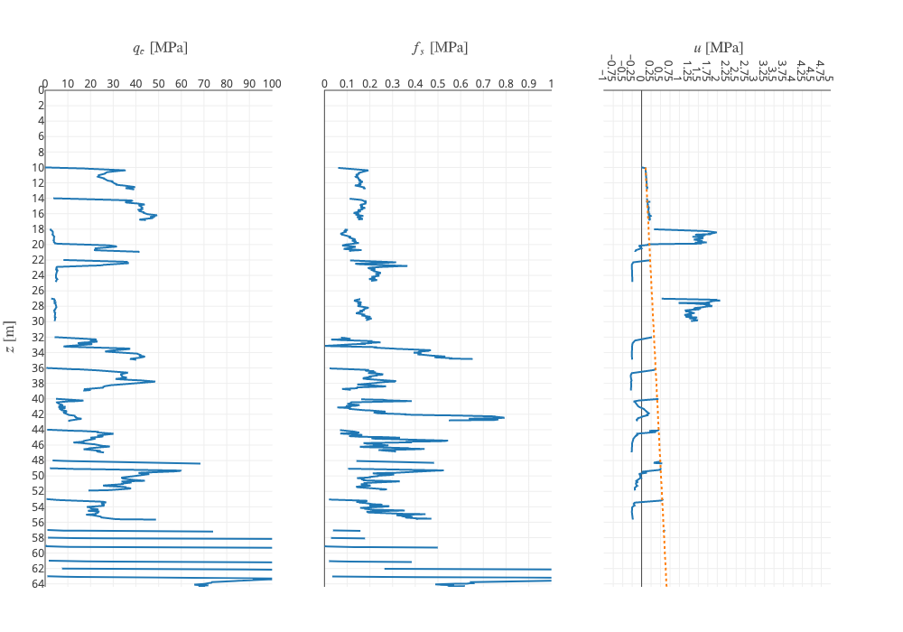

        Figure 3: Visualisation of data imported from .ags file

1.4. Combining PCPT data
~~~~~~~~~~~~~~~~~~~~~~~~

We can combine data from multiple sources (e.g. seabed PCPT + downhole
PCPT) into one ``PCPTProcessing`` object. We do this using the
``combine_pcpt`` method. This method takes another ``PCPTProcessing``
object and merges its data into the ``data`` attribute of the original
``PCPTProcessing`` object. The user can select what to do in the areas
where overlap exists using the ``keep`` keyword argument.

We can demonstrate this with an example where we load the seabed PCPT
corresponding to the ``ags_pcpt`` object created above.

.. code:: ipython3

    ags_seabed_pcpt_data = read_ags(file_path="Data/N6016_BH_WFS1-9_AGS4_150909.ags", groupname="SCPT")

.. parsed-literal::

    /anaconda3/envs/geotech37/lib/python3.6/site-packages/ugentgeotechnics-0.1.0-py3.6.egg/geotechnics/site_investigation/read_site_data.py:57: UserWarning:

    No empty row detected below group, reading to the end of the file

.. code:: ipython3

    ags_seabed_location_data = read_ags(file_path="Data/N6016_BH_WFS1-9_AGS4_150909.ags", groupname="LOCA")

.. code:: ipython3

    ags_seabed_pcpt = PCPTProcessing(
        title="AGS Seabed PCPT",
        easting=ags_seabed_location_data["LOCA_NATE [m]"].iloc[0],
        northing=ags_seabed_location_data["LOCA_NATN [m]"].iloc[0], elevation=-24.0, srid=25831)
    ags_seabed_pcpt.load_pandas(
        df=ags_seabed_pcpt_data,
        z_key="SCPT_DPTH [m]",
        qc_key="SCPT_RES [MN/m2]",
        fs_key="SCPT_FRES [kN/m2]",
        u2_key="SCPT_PWP2 [kN/m2]",
        push_key="SCPG_TESN [nan]",
        fs_multiplier=0.001,
        u2_multiplier=0.001)
    ags_seabed_pcpt.plot_raw_pcpt(u2_range=(-1, 5), u2_tick=0.25)

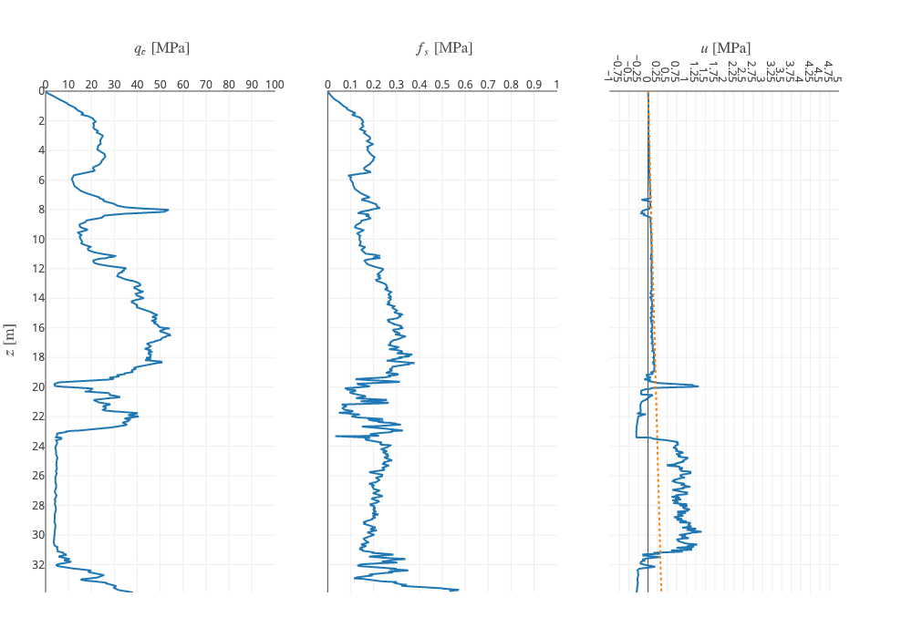

        Figure 4: Visualisation of seabed PCPT data

.. code:: ipython3

    ags_seabed_pcpt.combine_pcpt(obj=ags_pcpt)

.. code:: ipython3

    ags_seabed_pcpt.data.head()

.. raw:: html

    

    
    <table border="1" class="dataframe">
      <thead>
        <tr style="text-align: right;">
          <th></th>
          <th>HEADING [UNIT]</th>
          <th>LOCA_ID [nan]</th>
          <th>Push</th>
          <th>z [m]</th>
          <th>qc [MPa]</th>
          <th>fs [MPa]</th>
          <th>u2 [MPa]</th>
          <th>SCPT_FRR [%]</th>
          <th>SCPT_QT [MN/m2]</th>
          <th>SCPT_QNET [MN/m2]</th>
          <th>SCPT_BQ [nan]</th>
          <th>FILE_FSET [nan]</th>
        </tr>
      </thead>
      <tbody>
        <tr>
          <th>0</th>
          <td>DATA</td>
          <td>CPT_WFS1_9</td>
          <td>1-1</td>
          <td>0.00</td>
          <td>0.118</td>
          <td>NaN</td>
          <td>NaN</td>
          <td>NaN</td>
          <td>0.119</td>
          <td>0.119</td>
          <td>0.0226</td>
          <td>NaN</td>
        </tr>
        <tr>
          <th>1</th>
          <td>DATA</td>
          <td>CPT_WFS1_9</td>
          <td>1-1</td>
          <td>0.02</td>
          <td>0.200</td>
          <td>NaN</td>
          <td>0.0032</td>
          <td>NaN</td>
          <td>0.202</td>
          <td>0.201</td>
          <td>0.0142</td>
          <td>NaN</td>
        </tr>
        <tr>
          <th>2</th>
          <td>DATA</td>
          <td>CPT_WFS1_9</td>
          <td>1-1</td>
          <td>0.04</td>
          <td>0.276</td>
          <td>NaN</td>
          <td>0.0029</td>
          <td>NaN</td>
          <td>0.277</td>
          <td>0.276</td>
          <td>0.0091</td>
          <td>NaN</td>
        </tr>
        <tr>
          <th>3</th>
          <td>DATA</td>
          <td>CPT_WFS1_9</td>
          <td>1-1</td>
          <td>0.06</td>
          <td>0.377</td>
          <td>0.002307</td>
          <td>0.0030</td>
          <td>0.632</td>
          <td>0.378</td>
          <td>0.377</td>
          <td>0.0064</td>
          <td>NaN</td>
        </tr>
        <tr>
          <th>4</th>
          <td>DATA</td>
          <td>CPT_WFS1_9</td>
          <td>1-1</td>
          <td>0.08</td>
          <td>0.516</td>
          <td>0.002959</td>
          <td>0.0034</td>
          <td>0.603</td>
          <td>0.517</td>
          <td>0.516</td>
          <td>0.0043</td>
          <td>NaN</td>
        </tr>
      </tbody>
    </table>
    

.. code:: ipython3

    ags_seabed_pcpt.plot_raw_pcpt(u2_range=(-1, 5), u2_tick=0.25)

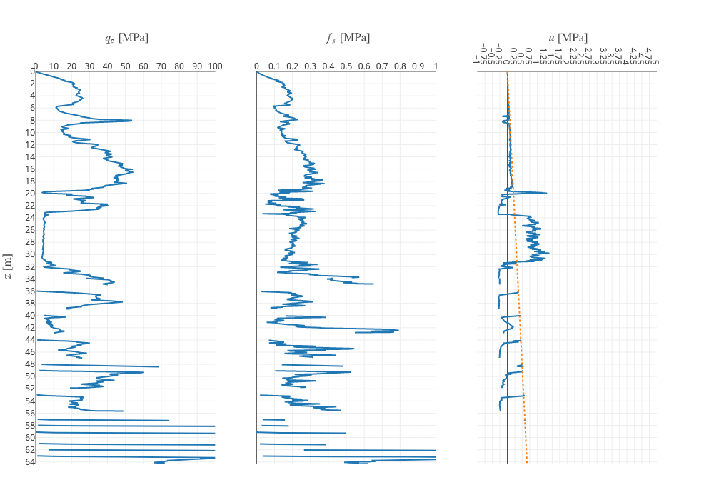

        Figure 5: Visualisation of merged seabed and downhole PCPT data

The object can be exported to a JSON format using the following column
structure:

.. code:: ipython3

    ags_seabed_pcpt.to_json(write_file=True, output_path="Output/example.json")

1.5. Loading a00 data
~~~~~~~~~~~~~~~~~~~~~

The ``PCPTProcessing`` class has a method ``load_a00`` for loading .a00
files, another common PCPT data transfer format.

.. code:: ipython3

    a00_pcpt = PCPTProcessing(title='A00 example')
    a00_pcpt.load_a00(
        path="Data/a00 example.A00",
        column_widths=[8, 10, 11, 11, 11, 11, 11],
        z_key='Depth [m]', qc_key='Cone [MPa]', fs_key='Friction [MPa]', u2_key='Pore 2 [MPa]')

.. code:: ipython3

    a00_pcpt.plot_raw_pcpt(u2_range=(-0.5, 1), u2_tick=0.25)

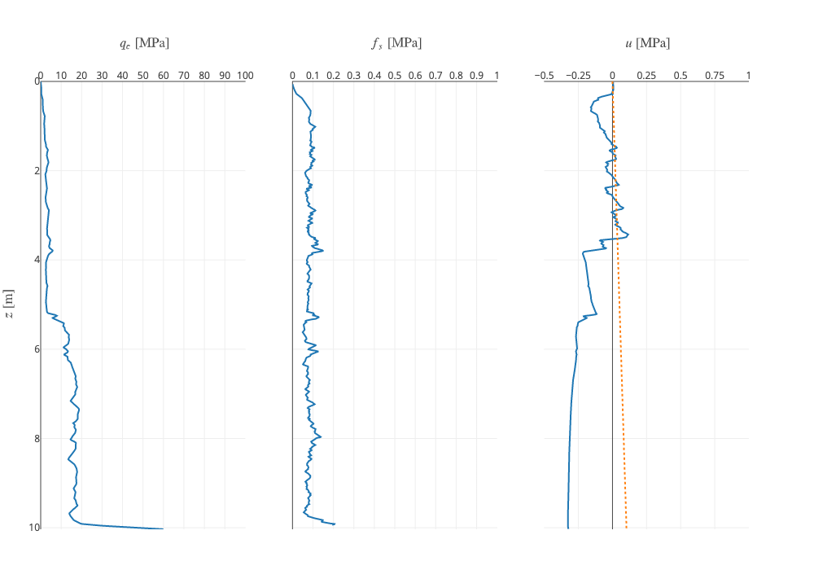

        Figure 6: Visualisation of data imported from .a00 file

2. Setting cone and layer properties
------------------------------------

The cone and layer properties can be set based on the cone used and the layering identified.
A ``SoilProfile`` object can be created for these properties.
A basic structure with cone properties is available in the ``groundhog`` package.

.. code:: ipython3

    from groundhog.siteinvestigation.insitutests.pcpt_processing import DEFAULT_CONE_PROPERTIES
    DEFAULT_CONE_PROPERTIES

The cone properties can be customised or an entirely new ``SoilProfile`` object can
be defined. Here, we will keep the default properties.

A layering definition also needs to be defined through a ``SoilProfile`` object.
The total unit weight needs to be specified for the vertical stress calculation.

.. code:: ipython3

    layering = SoilProfile({
        "Depth from [m]": [0, 3.16, 5.9, 14.86, 15.7],
        "Depth to [m]": [3.16, 5.9, 14.86, 15.7, 20],
        "Total unit weight [kN/m3]": [18, 17, 19.5, 20, 20],
        'Soil type': ['SAND', 'CLAY', 'SAND', 'SAND', 'SAND']
    })
    layering

The cone and layer properties can be mapped to the cone data grid using the ``map_properties`` method:

.. code:: ipython3

    pcpt.map_properties(layer_profile=layering, cone_profile=DEFAULT_CONE_PROPERTIES)

Following mapping of the layering, the plot with raw cone data will also include the selected layers.

.. code:: ipython3

    pcpt.plot_raw_pcpt()

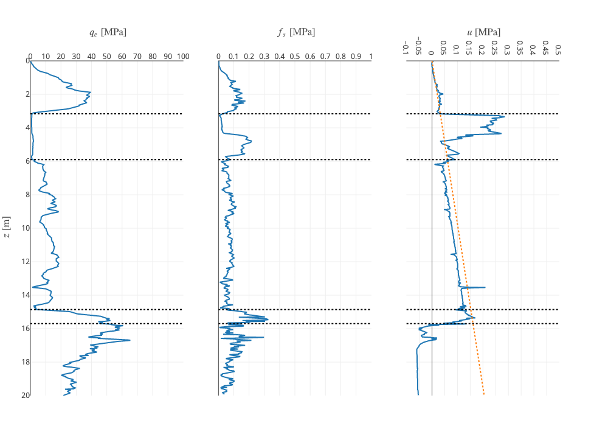

        Figure 7: Visualisation of PCPT data with layering

3. Normalising PCPT data
------------------------

PCPT can be normalised using the equations for normalised cone
resistance :math:`Q_t`, normalised sleeve friction :math:`F_r` and the pore
pressure parameter :math:`B_q`. The ``normalise_pcpt`` method of the
``PCPTProcessing`` class allows this normalisation to happen in one
calculation step:

.. code:: ipython3

    pcpt.normalise_pcpt()

Plotting of the resulting properties can be executed with the
``plot_normalised_pcpt`` method.

.. code:: ipython3

    pcpt.plot_normalised_pcpt()

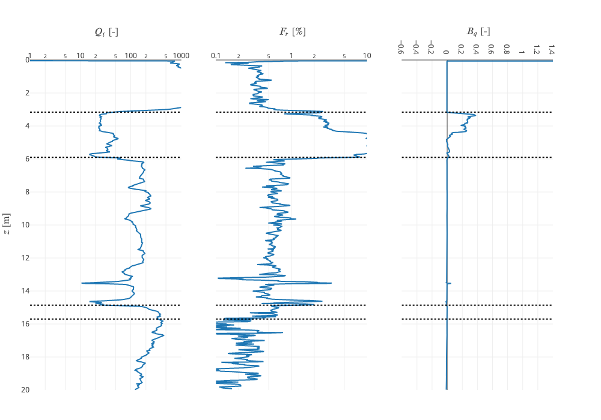

        Figure 8: Visualisation of normalised PCPT data with layering

The data points can also be plotted in the Robertson chart per layer. We
just need to tell it where the background images for the Roberson chart
are.

.. code:: ipython3

    pcpt.plot_robertson_chart(backgroundimagedir="Images")

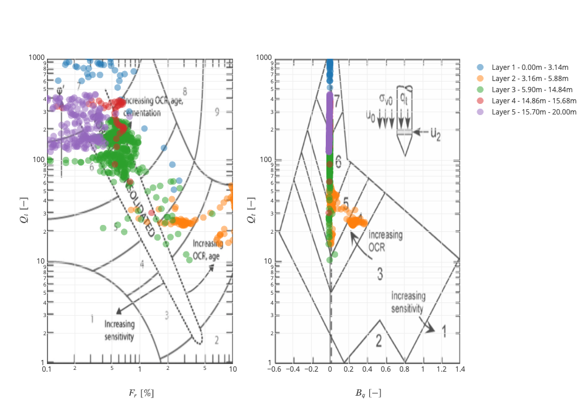

        Figure 9: Visualisation of normalised PCPT data plotted in Robertson chart

4. Applying correlations to PCPT data
-------------------------------------

Correlations can be applied to the processed PCPT data using method
``apply_correlation`` with the keys outlined in the documentation. For
example ``'Robertson and Wride (1998)'`` calculates the soil behaviour
type index. The method argument ``outkey`` is the name of the column in
the resulting dataframe. The method argument ``resultkey`` is the key in
the output dictionary of the function which needs to be taken. For
example, the function ``gmax_clay_maynerix`` has the key ``Gmax [kPa]``
in the result dictionary. This key needs to be selected.

.. code:: ipython3

    pcpt.apply_correlation('Robertson and Wride (1998)', outkey='Ic [-]', resultkey='Ic [-]')
    pcpt.apply_correlation(
        'Rix and Stokoe (1991)', outkey='Gmax sand [kPa]', resultkey='Gmax [kPa]',
        apply_for_soiltypes=['SAND',])
    pcpt.apply_correlation(
        'Mayne and Rix (1993)', outkey='Gmax clay [kPa]', resultkey='Gmax [kPa]',
        apply_for_soiltypes=['CLAY',])

The calculated properties can be visaulized with the method
``plot_properties``. The keys to be plotted in each panel need to be
provided as a tuple per panel. In the example below, the first panel
only contains ``qc [MPa]`` and the second ``Ic [-]``. The third panel
contains :math:`G_{max}`in sand and clay.

.. code:: ipython3

    pcpt.plot_properties(
        prop_keys=[('qc [MPa]',), ('Ic [-]',), ('Gmax sand [kPa]', 'Gmax clay [kPa]')],
        plot_ranges=((0, 100), (0, 5), (0, 200e3)),
        plot_ticks=(10, 0.5, 25e3, 25e3),
        axis_titles=(r'$ q_c \ \text{[MPa]} $', r'$ I_c \ \text{[-]} $',
                     r'$ G_{max} \ \text{[kPa]} $'))

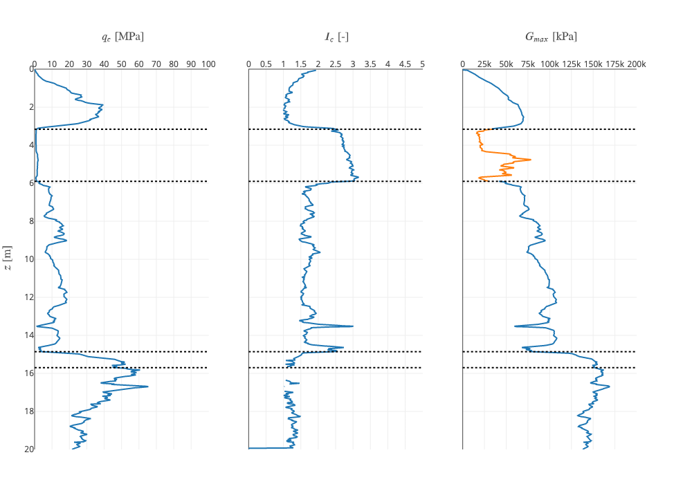

        Figure 10: Visualisation of soil mechanics parameters from correlations with PCPT data

These properties can also be plotted in a plot with a mini-log on the left.
The layering ``SoilProfile`` needs to contain a column ``Soil type`` to achieve this.

.. code:: ipython3

    logfig = pcpt.plot_properties_withlog(
        prop_keys=[('qc [MPa]',), ('Ic [-]',), ('Gmax sand [kPa]', 'Gmax clay [kPa]')],
        showlegends=((False,), (False,), (True, True)),
        plot_ranges=((0, 100), (0, 5), (0, 200e3)),
        plot_ticks=(10, 0.5, 25e3, 25e3),
        axis_titles=(r'$ q_c \ \text{[MPa]} $', r'$ I_c \ \text{[-]} $',
                     r'$ G_{max} \ \text{[kPa]} $'),
        zrange=(20, 0),
        layout=dict(width=1000)
        )

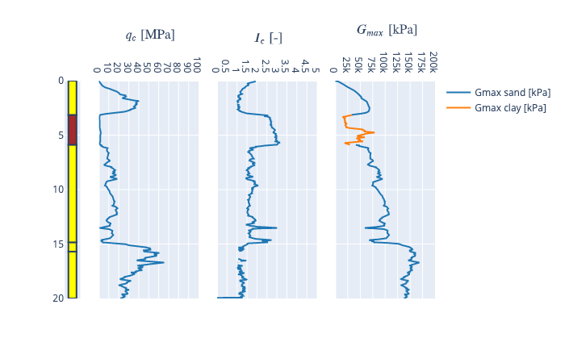

        Figure 11: Visualisation of soil mechanics parameters from correlations with PCPT data together with mini-log
