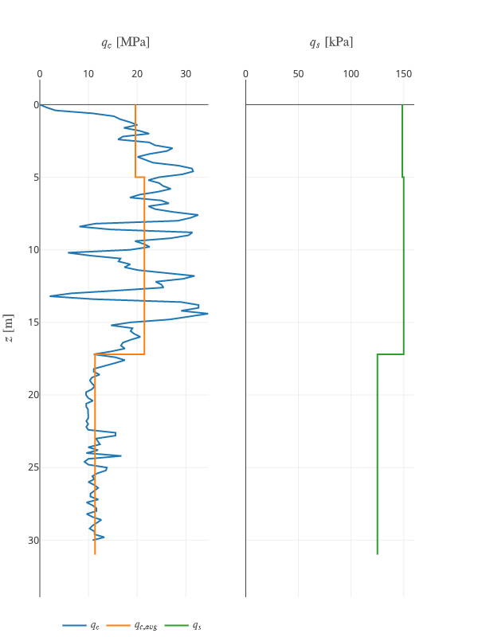

Tutorial: Pile calculations
=============================

The current software provided by BGGG-GBMS for calculations according to
the base resistance method by De Beer is relatively old and doesn’t lend
itself to automation. A Python library for application of De Beer’s
method was developed and is benchmarked against the CPTEX method in this
example.

1. Package imports
------------------

A number of Python packages are imported for data manipulation, printing
output in the notebook and interactive plotting (Plotly).

.. code:: ipython3

    import numpy as np
    import os
    from IPython.display import HTML
    import pandas as pd

.. code:: ipython3

    from plotly import tools
    import plotly.graph_objs as go
    import plotly.io as pio
    import plotly.figure_factory as ff
    from plotly.colors import DEFAULT_PLOTLY_COLORS
    from plotly.offline import download_plotlyjs, init_notebook_mode, plot, iplot
    init_notebook_mode()

The actual code for executing the pile calculation according to De Beer
is located in the package ``debeer``.

.. code:: ipython3

    from debeer.calculation import DeBeerCalculation

2. Data reading
---------------

The CPT data can be read from the CPTEX export using the ``read_csv``
function from Pandas. The calculation will be benchmarked against this
data. The example of Oud-Turnhout is used here.

.. code:: ipython3

    df = pd.read_csv("Data/Oud-Turnhout II.csv", delimiter=';', decimal=',')
    df.head()

.. raw:: html

    

    
    <table border="1" class="dataframe">
      <thead>
        <tr style="text-align: right;">
          <th></th>
          <th>Diepte[m]</th>
          <th>Maaiveld[m]</th>
          <th>Conuswaarden[MN/m²]</th>
          <th>Phi'[°]</th>
          <th>C[-]</th>
          <th>qb[MN/m²]</th>
          <th>Unnamed: 6</th>
        </tr>
      </thead>
      <tbody>
        <tr>
          <th>0</th>
          <td>0.0</td>
          <td>0.0</td>
          <td>0.00</td>
          <td>0.0</td>
          <td>0.0</td>
          <td>0.00</td>
          <td>NaN</td>
        </tr>
        <tr>
          <th>1</th>
          <td>0.2</td>
          <td>-0.2</td>
          <td>1.43</td>
          <td>35.7</td>
          <td>683.3</td>
          <td>0.40</td>
          <td>NaN</td>
        </tr>
        <tr>
          <th>2</th>
          <td>0.4</td>
          <td>-0.4</td>
          <td>3.23</td>
          <td>36.3</td>
          <td>771.7</td>
          <td>0.47</td>
          <td>NaN</td>
        </tr>
        <tr>
          <th>3</th>
          <td>0.6</td>
          <td>-0.6</td>
          <td>10.84</td>
          <td>39.9</td>
          <td>1726.6</td>
          <td>1.09</td>
          <td>NaN</td>
        </tr>
        <tr>
          <th>4</th>
          <td>0.8</td>
          <td>-0.8</td>
          <td>15.24</td>
          <td>40.2</td>
          <td>1820.5</td>
          <td>1.50</td>
          <td>NaN</td>
        </tr>
      </tbody>
    </table>
    

3. Calculation setup
--------------------

A calculation is set up by specifying the depths and corresponding cone
tip resistance values as well as the diameter of the pile to be
considered. The data is resampled to a 0.2m grid to allow use of De
Beer’s method using the ``resample_data`` method.

.. code:: ipython3

    calc = DeBeerCalculation(
        depth=df['Diepte[m]'],
        qc=df['Conuswaarden[MN/m²]'],
        diameter_pile=0.4)
    calc.resample_data()

4. Soil layering definition
---------------------------

The soil layering is defined based on the CPT data and requires some
engineering interpretation (aided by lab tests or more advanced CPT
processing). This is beyond the scope of this tutorial. The method
``set_soil_layers`` requires the definition of the top depths and bottom
depths of each layer as well as the soil types. Note that the soil types
need to be specific names (see detailed documentation). The water level
can also be set.

.. code:: ipython3

    calc.set_soil_layers(
        depth_from=[0, 17.2],
        depth_to=[17.2, 31],
        soil_type=["Sand", "Clayey sand / loam (silt)"],
        water_level=5)

5. Base resistance calculation
------------------------------

The entire base resistance calculation algorithm is contained in the
method ``calculate_base_resistance``. The documentation provides
detailed guidance. The algorithm is encoded based on the original
publication by De Beer and the benchmark calculations by MOW
geotechniek.

.. code:: ipython3

    calc.calculate_base_resistance()

A standardised plot of the base resistance is provided. This plot can be
used to draw the comparison between the result from CPTEX and the Python
procedure.

.. code:: ipython3

    calc.plot_base_resistance(show_fig=False)
    trace_cptex = go.Scatter(
        x=df['qb[MN/m²]'], y=df['Diepte[m]'], showlegend=True, mode='lines', name='CPTEX',
        line=dict(width=2, color='black', dash='dot'))
    calc.base_plot.append_trace(trace_cptex, 1, 1)
    iplot(calc.base_plot, filename='baseplot', config={'showLink': False})

.. figure:: images/tutorial_pile_1.png
        :figwidth: 500.0
        :width: 450.0
        :align: center

        Figure 1:  Unit base resistance calculation according to De Beer's method

6. Shaft resistance calculation
-------------------------------

For the shaft resistance calculation, the cone resistance values are
first corrected for the cone type effect. These corrections are
applicable for mechanical cones in tertiary clay.

.. code:: ipython3

    calc.correct_shaft_qc(cone_type='E')

The average cone resistance is subsequenty calculated in each layer:

.. code:: ipython3

    calc.calculate_average_qc()

This is followed by a conversion to unit shaft friction according to the
Belgian guidance:

.. code:: ipython3

    calc.calculate_unit_shaft_friction()

A standardised plot of the averages and the resulting unit shaft
friction is provided:

.. code:: ipython3

    calc.plot_unit_shaft_friction()

        Figure 2:  Average cone resistance and unit shaft friction

7. Calculation of shaft, base and total capacity
------------------------------------------------

The shaft and base capacity can be calculated using the applicable
factors. First the :math:`\alpha_s` and :math:`\alpha_b` factors are set:

.. code:: ipython3

    calc.set_shaft_base_factors(
        alpha_b_tertiary_clay=1, alpha_b_other=1,
        alpha_s_tertiary_clay=0.6, alpha_s_other=0.6)

Using this factors, the pile capacity is calculated. Note that the user
is still responsible for entering the correct values of the factors.

.. code:: ipython3

    calc.calculate_pile_resistance(
        pile_penetration=12, base_area=0.25 * np.pi * (0.51 ** 2),
        circumference=np.pi * 0.51, beta_base=1, lambda_base=1)

The resulting values of pile capacity can be printed to the notebook.

.. code:: ipython3

    HTML("""
    The shaft capacity $ R_s $ = %.1fkN, the base capacity $ R_b $ = %.1fkN, the total capacity $ R_c $ = %.1fkN""" % (
        calc.Rs, calc.Rb, calc.Rc))

.. raw:: html

    The shaft capacity R_s = 1723.7kN, the base capacity R_b = 1384.3kN, the total capacity R_c = 3108.1kN