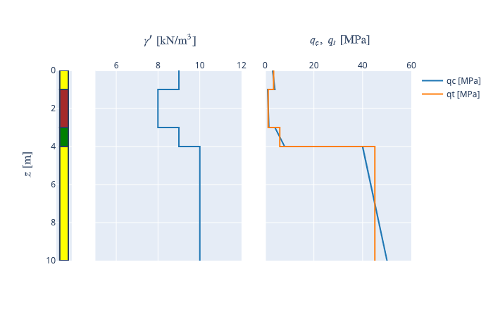
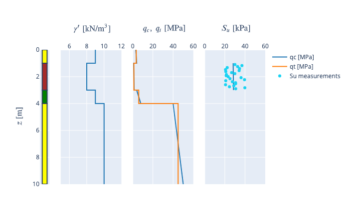
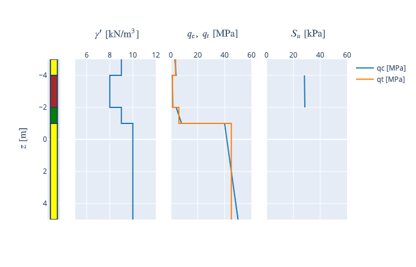
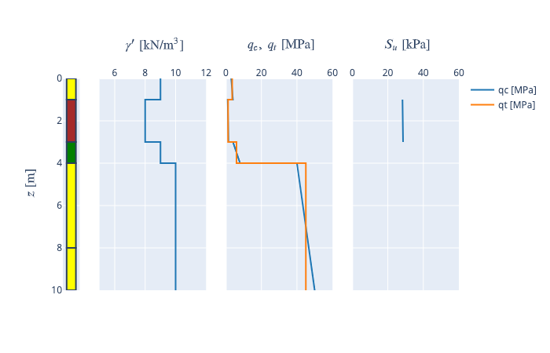
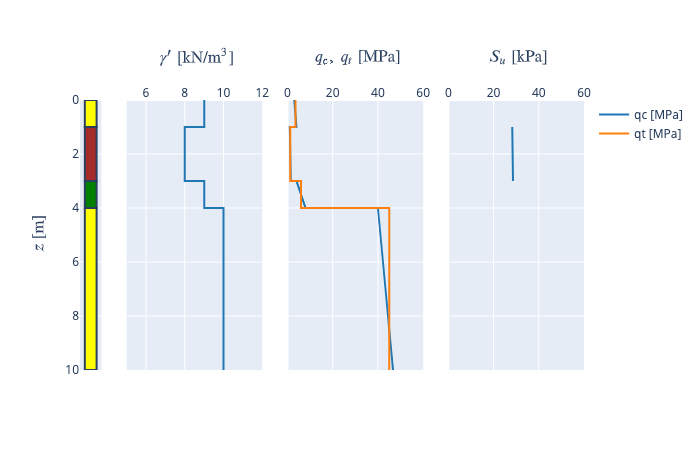
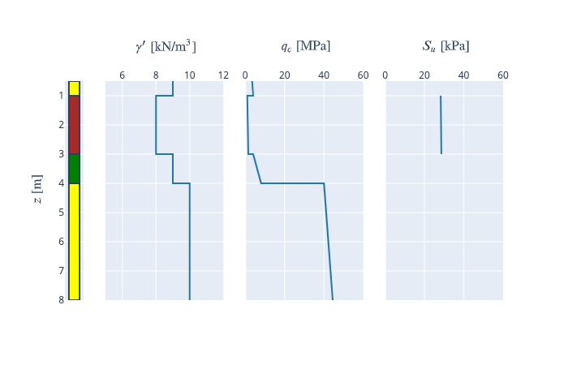
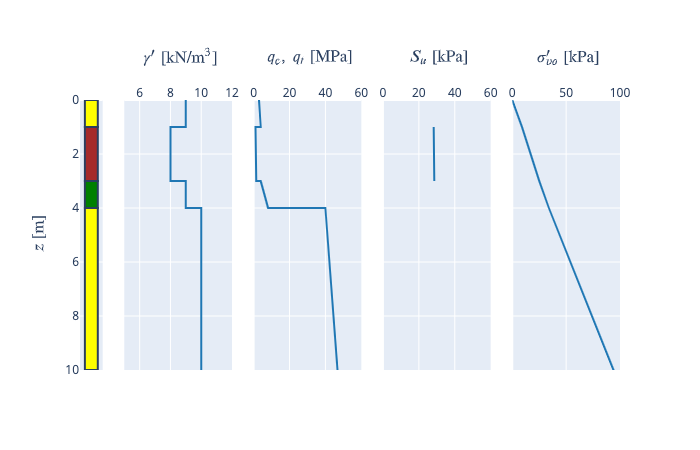
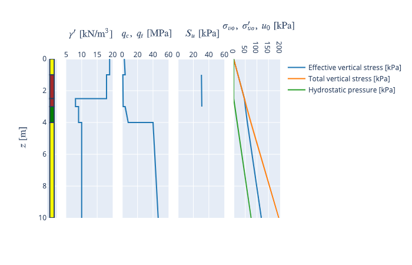
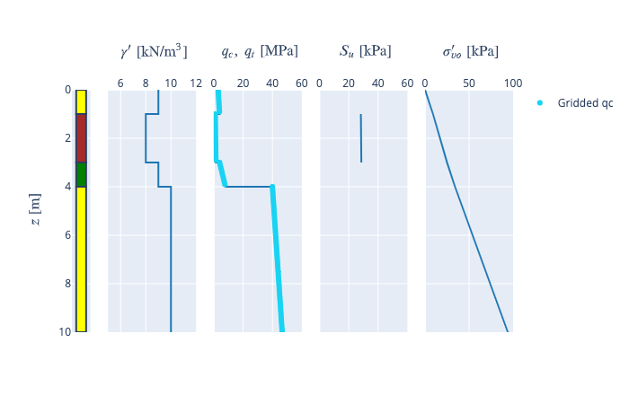

Soil profile objects in Groundhog
=================================

A soil profile is a table with several layers where the bottom depth of
the previous layer corresponds to the top depth of the next layer.

Because a soil profile is a dataframe with additional functionality, the
``SoilProfile`` class inherits from the ``DataFrame`` class.

Additional functionality is implemented to enable all common soil
profile manipulations such: - Retrieving minimum and maximum depth; -
Changing depth coordinate signs; - Changing the mudline level; -
Retrieving the soil parameters available in the dataframe; - Mapping the
soil parameters to a grid; - Plotting the soil profile;

This tutorial demonstrates this functionality.

.. code:: ipython3

    import pandas as pd
    import numpy as np
    from groundhog.general import soilprofile as sp

.. code:: ipython3

    from plotly import tools, subplots
    import plotly.express as px
    import plotly.graph_objs as go
    import plotly.io as pio
    import plotly.figure_factory as ff
    from plotly.colors import DEFAULT_PLOTLY_COLORS
    from plotly.offline import download_plotlyjs, init_notebook_mode, plot, iplot
    init_notebook_mode()


1. Soil profile creation
------------------------

There are a couple of standard scenarios for creating soil profiles:

-  Soil profile definition based on a Python dictionary;
-  Soil profile reading from Excel file

These two scenarios are demonstrated here.

1.1. Soil profile creation from Excel file
~~~~~~~~~~~~~~~~~~~~~~~~~~~~~~~~~~~~~~~~~~

When a soil profile is created from Excel, the layer are encoded as rows
and soil parameters names are put on the first row. The coordinate of
the top of the next layer should always correspond to the coordinate of
the bottom of the previous layer. There is one all-important convention
for soil parameters:

-  Numerical soil parameters have units between square brackets (e.g.
   ``qc [MPa]``)
-  Numerical soil parameters can have linear variations using the
   ``from`` and ``to`` words in the title (e.g. ``qc from [MPa]`` and
   ``qc to [MPa]``)
-  String soil parameters are specified without units, square brackets
   should not be used in the title

The user can use several names for the depth from and depth to columns.
``Depth from [m]`` and ``Depth to [m]`` are used by default but
different names and units can be used by specifying the ``depth_key``
and ``unit`` keyword arguments.

As an example a file with depth (z) specified in imperial units can be
read.

.. code:: ipython3

    profile_1 = sp.read_excel("Output/soilprofile_basic.xlsx", depth_key='z', unit='ft')
    profile_1


.. raw:: html

    <div>
    <style scoped>
        .dataframe tbody tr th:only-of-type {
            vertical-align: middle;
        }

        .dataframe tbody tr th {
            vertical-align: top;
        }

        .dataframe thead th {
            text-align: right;
        }
    </style>
    <table border="1" class="dataframe">
      <thead>
        <tr style="text-align: right;">
          <th></th>
          <th>z from [ft]</th>
          <th>z to [ft]</th>
          <th>Soil type</th>
          <th>Relative density</th>
          <th>qc from [MPa]</th>
          <th>qc to [MPa]</th>
          <th>qt [MPa]</th>
          <th>Subm unit weight [kN/m3]</th>
        </tr>
      </thead>
      <tbody>
        <tr>
          <th>0</th>
          <td>0</td>
          <td>3</td>
          <td>SAND</td>
          <td>Loose</td>
          <td>3</td>
          <td>4.0</td>
          <td>3.50</td>
          <td>9</td>
        </tr>
        <tr>
          <th>1</th>
          <td>3</td>
          <td>9</td>
          <td>CLAY</td>
          <td>NaN</td>
          <td>1</td>
          <td>1.5</td>
          <td>1.25</td>
          <td>8</td>
        </tr>
        <tr>
          <th>2</th>
          <td>9</td>
          <td>12</td>
          <td>SILT</td>
          <td>Medium dense</td>
          <td>4</td>
          <td>8.0</td>
          <td>6.00</td>
          <td>9</td>
        </tr>
        <tr>
          <th>3</th>
          <td>12</td>
          <td>30</td>
          <td>SAND</td>
          <td>Dense</td>
          <td>40</td>
          <td>50.0</td>
          <td>45.00</td>
          <td>10</td>
        </tr>
      </tbody>
    </table>
    </div>


1.2. Soil profile from dictionary
~~~~~~~~~~~~~~~~~~~~~~~~~~~~~~~~~

A soil profile can be directly specified in the notebook through a
dictionary. The same profile can be loaded but in SI units. Note that
``Depth from [m]`` and ``Depth to [m]`` are required here.

.. code:: ipython3

    profile_2 = sp.SoilProfile({
        'Depth from [m]': [0, 1, 3, 4],
        'Depth to [m]': [1, 3, 4, 10],
        'Soil type': ['SAND', 'CLAY', 'SILT', 'SAND'],
        'Relative density': ['Loose', None, 'Medium dense', 'Dense'],
        'qc from [MPa]': [3, 1, 4, 40],
        'qc to [MPa]': [4, 1.5, 8, 50],
        'qt [MPa]': [3.5, 1.25, 6, 45],
        'Subm unit weight [kN/m3]': [9, 8, 9, 10]
    })
    fig = profile_2.plot_profile(
        parameters=(('Subm unit weight [kN/m3]',), ('qc [MPa]', 'qt [MPa]')),
        showlegends=((False,), (True, True)),
        xtitles=(r'$ \gamma^{\prime} \ \text{[kN/m} ^3 \text{]} $', r'$ q_c, \ q_t \ \text{[MPa]} $'),
        ztitle=r'$ z \ \text{[m]} $',
        xranges=((5, 12), (0, 60)),
        yrange=(10, 0))




        Figure 1:  Soil profile created from a dictionary


2. Retrieving information from ``SoilProfile`` objects
------------------------------------------------------

``SoilProfile`` objects have properties which allow the user to quickly
assess the contents of the soil profile.

2.1. Top and bottom depth
~~~~~~~~~~~~~~~~~~~~~~~~~

The minimum and maximum depth of the soil profile can be retrieved using
``min_depth`` and ``max_depth`` attributes.

.. code:: ipython3

    profile_2.min_depth, profile_2.max_depth


.. parsed-literal::

    (0, 10)


2.2. Soil parameters
~~~~~~~~~~~~~~~~~~~~

The ``SoilProfile`` objects has a method to retrieve the numerical and
string soil parameters.

.. code:: ipython3

    profile_2.numerical_soil_parameters()


.. parsed-literal::

    ['qc [MPa]', 'qt [MPa]', 'Subm unit weight [kN/m3]']


.. code:: ipython3

    profile_2.string_soil_parameters()


.. parsed-literal::

    ['Soil type', 'Relative density']


For the numerical soil parameters, the method ``check_linear_variation``
allows to check whether the parameter is constant in the layer or
whether is has a linear variation. Linear variations are encoded in the
soil profile by using the ``to`` and ``from`` column keys (e.g.
``qc from [MPa]`` and ``qc to [MPa]``).

.. code:: ipython3

    for _param in profile_2.numerical_soil_parameters():
        if profile_2.check_linear_variation(_param):
            print("Parameter %s shows a linear variation" % _param)
        else:
            print("Parameter %s is constant in each layer" % _param)


.. parsed-literal::

    Parameter qc [MPa] shows a linear variation
    Parameter qt [MPa] is constant in each layer
    Parameter Subm unit weight [kN/m3] is constant in each layer


3. Selection of soil parameters
-------------------------------

The ``SoilProfile`` object has a method for automatic selection of
design lines based on parameter values in the layer. This can be
demonstrated using a couple of randomly selected value for the undrained
shear strength.

.. code:: ipython3

    depths = np.linspace(1.1, 2.9, 25)
    su_values = 20 + 20 * np.random.rand(25)

.. code:: ipython3

    profile_2.selection_soilparameter(
        parameter='Su [kPa]',
        depths=depths,
        values=su_values,
        rule='mean',
        linearvariation=True)
    profile_2


.. raw:: html

    <div>
    <style scoped>
        .dataframe tbody tr th:only-of-type {
            vertical-align: middle;
        }

        .dataframe tbody tr th {
            vertical-align: top;
        }

        .dataframe thead th {
            text-align: right;
        }
    </style>
    <table border="1" class="dataframe">
      <thead>
        <tr style="text-align: right;">
          <th></th>
          <th>Depth from [m]</th>
          <th>Depth to [m]</th>
          <th>Soil type</th>
          <th>Relative density</th>
          <th>qc from [MPa]</th>
          <th>qc to [MPa]</th>
          <th>qt [MPa]</th>
          <th>Subm unit weight [kN/m3]</th>
          <th>Su from [kPa]</th>
          <th>Su to [kPa]</th>
        </tr>
      </thead>
      <tbody>
        <tr>
          <th>0</th>
          <td>0</td>
          <td>1</td>
          <td>SAND</td>
          <td>Loose</td>
          <td>3</td>
          <td>4.0</td>
          <td>3.50</td>
          <td>9</td>
          <td>NaN</td>
          <td>NaN</td>
        </tr>
        <tr>
          <th>1</th>
          <td>1</td>
          <td>3</td>
          <td>CLAY</td>
          <td>None</td>
          <td>1</td>
          <td>1.5</td>
          <td>1.25</td>
          <td>8</td>
          <td>28.266397</td>
          <td>28.59948</td>
        </tr>
        <tr>
          <th>2</th>
          <td>3</td>
          <td>4</td>
          <td>SILT</td>
          <td>Medium dense</td>
          <td>4</td>
          <td>8.0</td>
          <td>6.00</td>
          <td>9</td>
          <td>NaN</td>
          <td>NaN</td>
        </tr>
        <tr>
          <th>3</th>
          <td>4</td>
          <td>10</td>
          <td>SAND</td>
          <td>Dense</td>
          <td>40</td>
          <td>50.0</td>
          <td>45.00</td>
          <td>10</td>
          <td>NaN</td>
          <td>NaN</td>
        </tr>
      </tbody>
    </table>
    </div>


The selected line can be plotted by adding a trace to a plot with a
mini-log.

.. code:: ipython3

    su_trace = go.Scatter(x=su_values, y=depths, mode='markers', name='Su measurements')

    fig = profile_2.plot_profile(
        parameters=(('Subm unit weight [kN/m3]',), ('qc [MPa]', 'qt [MPa]'), ('Su [kPa]',)),
        showlegends=((False,), (True, True), (False,)),
        xtitles=(r'$ \gamma^{\prime} \ \text{[kN/m} ^3 \text{]} $',
                 r'$ q_c, \ q_t \ \text{[MPa]} $',
                 r'$ S_u \ \text{[kPa]} $'),
        ztitle=r'$ z \ \text{[m]} $',
        xranges=((5, 12), (0, 60), (0, 60)),
        zrange=(10, 0),
        showfig=False)

    fig.append_trace(su_trace, 1, 4)
    iplot(fig)




        Figure 2:  Automatic parameter selection

4. Soil profile manipulations
-----------------------------

A number of manipulations with soil profiles are possible using the
``SoilProfile`` class.

4.1. Shifting vs depth
~~~~~~~~~~~~~~~~~~~~~~

The profile can be shifted vs depth using the ``shift_depths`` method.
For example we can move the profile up by 5m. Note: Moving up requires a
negative offset to be specified (depth axis is positive in the downward
direction).

.. code:: ipython3

    profile_2.shift_depths(offset=-5)
    fig = profile_2.plot_profile(
        parameters=(('Subm unit weight [kN/m3]',), ('qc [MPa]', 'qt [MPa]'), ('Su [kPa]',)),
        showlegends=((False,), (True, True), (False,)),
        xtitles=(r'$ \gamma^{\prime} \ \text{[kN/m} ^3 \text{]} $',
                 r'$ q_c, \ q_t \ \text{[MPa]} $',
                 r'$ S_u \ \text{[kPa]} $'),
        ztitle=r'$ z \ \text{[m]} $',
        xranges=((5, 12), (0, 60), (0, 60)),
        zrange=(5, -5))




        Figure 3:  Shifting depths for a soil profile


Each time the ``shift_depths`` method is applied, a further shift is
applied, so be careful not to repeat code containing this method
inadvertently.

4.2. Flipping the depth axis
~~~~~~~~~~~~~~~~~~~~~~~~~~~~

In certain cases (e.g. when working with depths in mLAT), flipping of
the depth axis is required. This can be done using the
``convert_depth_sign``.

.. code:: ipython3

    profile_2.convert_depth_sign()
    fig = profile_2.plot_profile(
        parameters=(('Subm unit weight [kN/m3]',), ('qc [MPa]', 'qt [MPa]'), ('Su [kPa]',)),
        showlegends=((False,), (True, True), (False,)),
        xtitles=(r'$ \gamma^{\prime} \ \text{[kN/m} ^3 \text{]} $',
                 r'$ q_c, \ q_t \ \text{[MPa]} $',
                 r'$ S_u \ \text{[kPa]} $'),
        ztitle=r'$ z \ \text{[m]} $',
        xranges=((5, 12), (0, 60), (0, 60)),
        zrange=(-5, 5))


        Figure 4:  Flipping the depth axis

This statement can also be repeated. Note that most other methods of the
``SoilProfile`` object expect depths increasing downward!

For the further demonstrations of the functionality, we will reset the
depth reference:

.. code:: ipython3

    profile_2.convert_depth_sign()
    profile_2.shift_depths(offset=5)
    fig = profile_2.plot_profile(
        parameters=(('Subm unit weight [kN/m3]',), ('qc [MPa]', 'qt [MPa]'), ('Su [kPa]',)),
        showlegends=((False,), (True, True), (False,)),
        xtitles=(r'$ \gamma^{\prime} \ \text{[kN/m} ^3 \text{]} $',
                 r'$ q_c, \ q_t \ \text{[MPa]} $',
                 r'$ S_u \ \text{[kPa]} $'),
        ztitle=r'$ z \ \text{[m]} $',
        xranges=((5, 12), (0, 60), (0, 60)),
        zrange=(10, 0))


        Figure 5:  Soil profile after resetting depth reference


4.3. Inserting a layer transition
~~~~~~~~~~~~~~~~~~~~~~~~~~~~~~~~~

Inserting a layer transition is easily achieved using the
``insert_layer_transition`` method.

.. code:: ipython3

    profile_2.insert_layer_transition(depth=8)
    fig = profile_2.plot_profile(
        parameters=(('Subm unit weight [kN/m3]',), ('qc [MPa]', 'qt [MPa]'), ('Su [kPa]',)),
        showlegends=((False,), (True, True), (False,)),
        xtitles=(r'$ \gamma^{\prime} \ \text{[kN/m} ^3 \text{]} $',
                 r'$ q_c, \ q_t \ \text{[MPa]} $',
                 r'$ S_u \ \text{[kPa]} $'),
        ztitle=r'$ z \ \text{[m]} $',
        xranges=((5, 12), (0, 60), (0, 60)),
        zrange=(10, 0))



        Figure 6:  Soil profile after layer insertion at 8m depth


4.4. Merging layers
~~~~~~~~~~~~~~~~~~~

Layers can be merged using their index (starting from 0 for the top
layer). Note that the functionality still needs to be completed for
layers with linearly varying properties. By default, the properties of
the top layer are kept.

.. code:: ipython3

    profile_2.merge_layers(layer_ids=(3, 4))
    fig = profile_2.plot_profile(
        parameters=(('Subm unit weight [kN/m3]',), ('qc [MPa]', 'qt [MPa]'), ('Su [kPa]',)),
        showlegends=((False,), (True, True), (False,)),
        xtitles=(r'$ \gamma^{\prime} \ \text{[kN/m} ^3 \text{]} $',
                 r'$ q_c, \ q_t \ \text{[MPa]} $',
                 r'$ S_u \ \text{[kPa]} $'),
        ztitle=r'$ z \ \text{[m]} $',
        xranges=((5, 12), (0, 60), (0, 60)),
        zrange=(10, 0))




        Figure 7:  Soil profile after merging of layers


4.5. Removing soil parameters
~~~~~~~~~~~~~~~~~~~~~~~~~~~~~

A soil parameter can be removed using its name.

.. code:: ipython3

    profile_2.remove_parameter(parameter="qt [MPa]")
    profile_2


.. raw:: html

    <div>
    <style scoped>
        .dataframe tbody tr th:only-of-type {
            vertical-align: middle;
        }

        .dataframe tbody tr th {
            vertical-align: top;
        }

        .dataframe thead th {
            text-align: right;
        }
    </style>
    <table border="1" class="dataframe">
      <thead>
        <tr style="text-align: right;">
          <th></th>
          <th>Depth from [m]</th>
          <th>Depth to [m]</th>
          <th>Soil type</th>
          <th>Relative density</th>
          <th>qc from [MPa]</th>
          <th>qc to [MPa]</th>
          <th>Subm unit weight [kN/m3]</th>
          <th>Su from [kPa]</th>
          <th>Su to [kPa]</th>
        </tr>
      </thead>
      <tbody>
        <tr>
          <th>0</th>
          <td>0.0</td>
          <td>1.0</td>
          <td>SAND</td>
          <td>Loose</td>
          <td>3.0</td>
          <td>4.000000</td>
          <td>9.0</td>
          <td>NaN</td>
          <td>NaN</td>
        </tr>
        <tr>
          <th>1</th>
          <td>1.0</td>
          <td>3.0</td>
          <td>CLAY</td>
          <td>None</td>
          <td>1.0</td>
          <td>1.500000</td>
          <td>8.0</td>
          <td>28.266397</td>
          <td>28.59948</td>
        </tr>
        <tr>
          <th>2</th>
          <td>3.0</td>
          <td>4.0</td>
          <td>SILT</td>
          <td>Medium dense</td>
          <td>4.0</td>
          <td>8.000000</td>
          <td>9.0</td>
          <td>NaN</td>
          <td>NaN</td>
        </tr>
        <tr>
          <th>3</th>
          <td>4.0</td>
          <td>10.0</td>
          <td>SAND</td>
          <td>Dense</td>
          <td>40.0</td>
          <td>46.666667</td>
          <td>10.0</td>
          <td>NaN</td>
          <td>NaN</td>
        </tr>
      </tbody>
    </table>
    </div>


4.6. Cutting a soil profile
~~~~~~~~~~~~~~~~~~~~~~~~~~~

A specific section of the soil profile can be ``cut_profile`` method. A
deep copy of the soil profile is then returned which is a
``SoilProfile`` object in itself. The cutting process takes linearly
varying parameters into consideration.

.. code:: ipython3

    profile_extract = profile_2.cut_profile(top_depth=0.5, bottom_depth=8)
    fig = profile_extract.plot_profile(
        parameters=(('Subm unit weight [kN/m3]',), ('qc [MPa]', ), ('Su [kPa]',)),
        showlegends=((False,), (False,), (False,)),
        xtitles=(r'$ \gamma^{\prime} \ \text{[kN/m} ^3 \text{]} $',
                 r'$ q_c \ \text{[MPa]} $',
                 r'$ S_u \ \text{[kPa]} $'),
        ztitle=r'$ z \ \text{[m]} $',
        xranges=((5, 12), (0, 60), (0, 60)),
        zrange=(8, 0.5))




        Figure 8:  Soil profile after cutting at 8m depth


4.7. Integration of a soil parameter vs depth
~~~~~~~~~~~~~~~~~~~~~~~~~~~~~~~~~~~~~~~~~~~~~

A soil parameter can be integrated over the depth and the resulting
property can be added to the ``SoilProfile`` dataframe. This only works
for soil parameters with a constant value in each layer and with
properties specified in each layer (no NaN values). This can be
demonstrated for the vertical effective stress, as integrated from the
effective unit weight.

.. code:: ipython3

    profile_2.depth_integration(parameter='Subm unit weight [kN/m3]', outputparameter='Vertical effective stress [kPa]')
    fig = profile_2.plot_profile(
        parameters=(('Subm unit weight [kN/m3]',), ('qc [MPa]',), ('Su [kPa]',), ('Vertical effective stress [kPa]',)),
        showlegends=((False,), (False,), (False,), (False,)),
        xtitles=(r'$ \gamma^{\prime} \ \text{[kN/m} ^3 \text{]} $',
                 r'$ q_c, \ q_t \ \text{[MPa]} $',
                 r'$ S_u \ \text{[kPa]} $',
                 r'$ \sigma_{vo}^{\prime} \ \text{[kPa]} $'),
        ztitle=r'$ z \ \text{[m]} $',
        xranges=((5, 12), (0, 60), (0, 60), (0, 100)),
        zrange=(10, 0))




        Figure 9:  Vertical effective stress calculation on a soil profile

Since calculation of overburden is a recurring task in geotechnical analyses, the method ```calculate_overburden``` is implemented to calculate hydrostatic water pressure, total and effective vertical stress with a single statement.

The water level can be adjusted. If a layer interface is not present at the location of the water level, an additional interface is created. The soil profile needs to contain a column with the total unit weight to allow the calculation to happen. In layers above the water level, the total unit weight is the dry unit weight and the effective unit weight is equal to this value. In the layers below the water table, the effective unit weight is obtained by subtracting the water unit weight (default 10kN/m$^3$) from the total unit weight.

.. code:: ipython3

    profile_2['Total unit weight [kN/m3]'] = [19, 18, 19, 20]
    profile_2.calculate_overburden(waterlevel=2.5)

.. code:: ipython3

    fig = profile_2.plot_profile(
        parameters=(('Effective unit weight [kN/m3]',), ('qc [MPa]',), ('Su [kPa]',),
                    ('Effective vertical stress [kPa]', 'Total vertical stress [kPa]', 'Hydrostatic pressure [kPa]')),
        showlegends=((False,), (False,), (False,), (True, True, True)),
        xtitles=(r'$ \gamma^{\prime} \ \text{[kN/m} ^3 \text{]} $',
                 r'$ q_c, \ q_t \ \text{[MPa]} $',
                 r'$ S_u \ \text{[kPa]} $',
                 r'$ \sigma_{vo}, \ \sigma_{vo}^{\prime}, \ u_0 \ \text{[kPa]} $'),
        ztitle=r'$ z \ \text{[m]} $',
        xranges=((5, 20), (0, 60), (0, 60), (0, 200)),
        zrange=(10, 0))



        Figure 10:  Overburden stress calculation using the ``calculate_overburden`` method


5. Gridding functionality
-------------------------

The ``SoilProfile`` object can be mapped onto a grid. All that is
required is a list or Numpy array with the depth coordinates of the
grid. The method ``map_soilprofile`` returns a dataframe with the mapped
soil parameters.

.. code:: ipython3

    grid = profile_2.map_soilprofile(
        nodalcoords=np.linspace(0, 10, 101))
    fig = profile_2.plot_profile(
        parameters=(('Subm unit weight [kN/m3]',), ('qc [MPa]',), ('Su [kPa]',), ('Vertical effective stress [kPa]',)),
        showlegends=((False,), (False,), (False,), (False,)),
        xtitles=(r'$ \gamma^{\prime} \ \text{[kN/m} ^3 \text{]} $',
                 r'$ q_c, \ q_t \ \text{[MPa]} $',
                 r'$ S_u \ \text{[kPa]} $',
                 r'$ \sigma_{vo}^{\prime} \ \text{[kPa]} $'),
        ztitle=r'$ z \ \text{[m]} $',
        xranges=((5, 12), (0, 60), (0, 60), (0, 100)),
        zrange=(10, 0),
        showfig=False)

    qc_grid_trace = go.Scatter(x=grid['qc [MPa]'], y=grid['z [m]'], mode='markers', name='Gridded qc')
    fig.append_trace(qc_grid_trace, 1, 3)
    iplot(fig)



        Figure 11:  Result of gridding based on a soil profile

